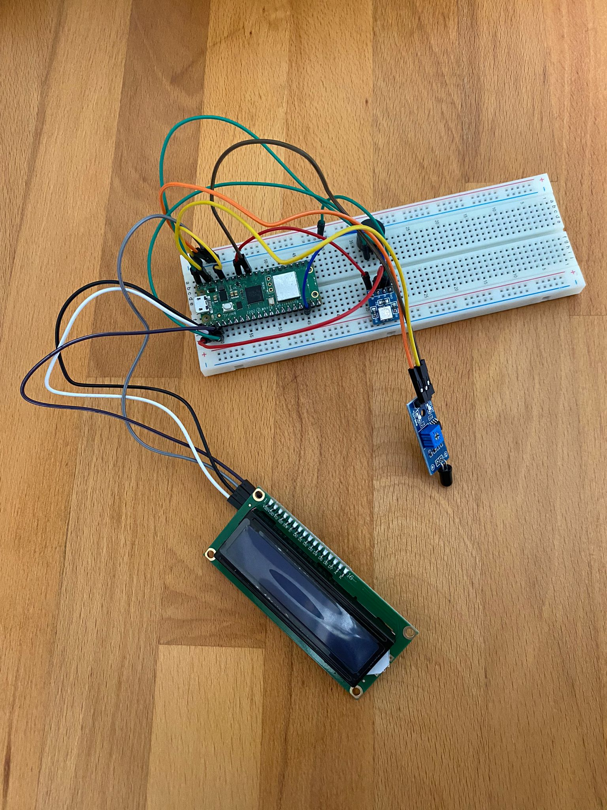

# Fire alarm system
A fire alarm system trigerred by a fire source or other sort of light source in the proximity

:::info

*Author*: Buta Iulia-Mirela \
 *GitHub Project Link*: https://github.com/UPB-FILS-MA/project-ButaIulia

 ## Description: 

 A fire alarm system trigerred by a fire source or other sort of light source in the proximity. It includes the following features:
 - Detection of the fire using a Flame Sensor.
 @@ -22,8 +21,8 @@ For my first embedded project I wanted to do something usefull for the everyday

 ## Arhitecture
 The architecture of the project is the following:
 1.Raspberry Pi Pico W: Microcontroller unit responsible for processing and controlling the system.
 2. 16×2 I2C LCD Display: Display module for visual notifications and system status.
 3. Fire Sensor: Detects the presence of fire or smoke.
 4. Buzzer: Audible alarm for alerting users.
 5. Power Supply: Provides power to the Raspberry Pi Pico and peripherals.
 @@ -48,16 +47,16 @@ The architecture of the project is the following:
 6. Jumper Wires – 10
 7. Micro-USB Cable – 1
 9. Buzzer - 1
 

 ## Connection Overview:
 * The fire sensor is connected to one of the GPIO pins of the Raspberry Pi Pico for detecting fire or smoke.
 * The buzzer is connected to another GPIO pin to sound the alarm when triggered.
 * The 16×2 I2C LCD Display is connected to the Raspberry Pi Pico via SPI for displaying system status and alerts.
 * The ST7789 display is connected to the Raspberry Pi Pico via SPI for displaying system status and alerts.
 * Power supply is connected to Raspberry Pi Pico for powering the entire system.

 ### Schematics
 
 ### Bill of Materials

 | Device | Usage | Price |
 |--------|--------|-------|
 | [Raspberry Pi Pico](https://www.optimusdigital.ro/en/raspberry-pi-boards/12394-raspberry-pi-pico-w.html) | The microcontroller | [39 lei](https://www.optimusdigital.ro/en/raspberry-pi-boards/12394-raspberry-pi-pico-w.html)|
 | [Breadboard](https://components101.com/sites/default/files/component_datasheet/HC%20SR501%20PIR%20Sensor%20Datasheet.pdf) | Motion Sensor | [9.98 RON](https://www.optimusdigital.ro/en/breadboards/8-breadboard-hq-830-points.html?search_query=breadboard&results=415&HTTP_REFERER=https%3A%2F%2Fwww.optimusdigital.ro%2Fen%2Fsearch%3Fcontroller%3Dsearch%26orderby%3Dposition%26orderway%3Ddesc%26search_query%3Dbreadboard%26submit_search%3D)|
 | [16X2 I2C LCD Display](https://www.optimusdigital.ro/ro/optoelectronice-lcd-uri/62-lcd-1602-cu-interfata-i2c-si-backlight-galben-verde.html) | Display | [14,99 RON](https://www.optimusdigital.ro/ro/optoelectronice-lcd-uri/62-lcd-1602-cu-interfata-i2c-si-backlight-galben-verde.html) |
 | [IR Flame Sensor](https://www.optimusdigital.ro/en/optical-sensors/110-ir-flame-sensor.html) | Flame Sensor | [2,49 RON](https://www.optimusdigital.ro/en/optical-sensors/110-ir-flame-sensor.html) |

 | Library                                  | Description                        | Usage                              |
 |-|-|-|
 | [embassy-rp](https://github.com/embassy-rs/embassy/tree/main/embassy-rp) | RP2040 pheripherals | Used for accesing the pheripherals of the microcontroller  |
 | [ag-lcd](https://github.com/mjhouse/ag-lcd) | Display library | Used for writing to the display |

 ## Links
 <!-- Add a few links that inspired you and that you think you will use for your project -->
 1. [Fire Alarm](https://how2electronics.com/fire-alarm-system-using-flame-sensor-raspberry-pi-pico/)
 2. https://diyprojectslab.com/flame-sensor-with-raspberry-pi-pico/
 3. https://www.youtube.com/watch?v=y1_scz9I0go
 